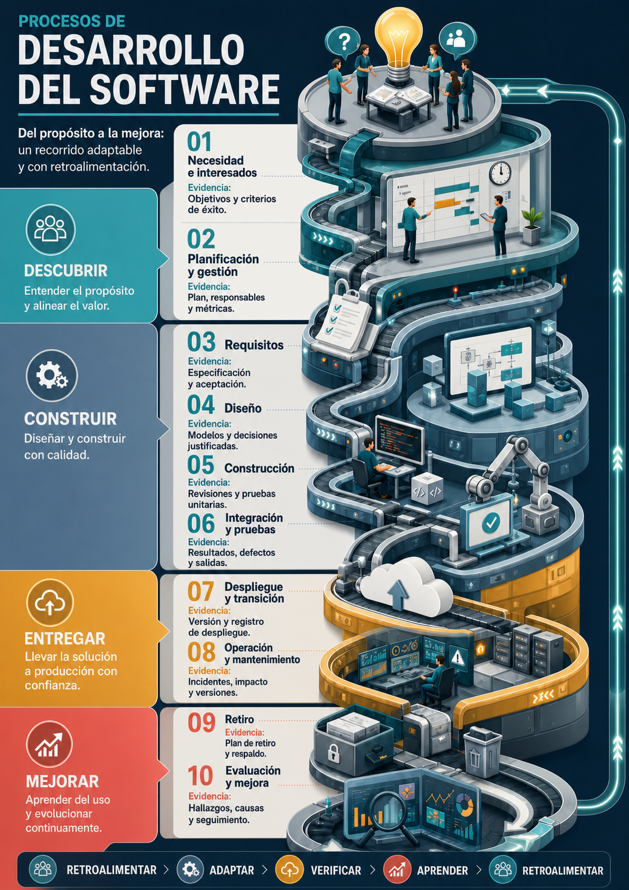

# Infografía: procesos de desarrollo del software

## Evidencia GA11-220501098-AA1-EV01

**Calidad en el proceso y modelos de referencia**

Iván Darío Madrid Daza 
Análisis y Desarrollo de Software 
Servicio Nacional de Aprendizaje (SENA) 
Instructor: José Ignacio Botero Osorio 
Julio de 2026

---

## Introducción

En esta evidencia caracterizo los principales procesos del desarrollo de *software* y explico cómo la calidad se integra durante todo el ciclo de vida. Un proceso de *software* organiza actividades, responsabilidades, entradas, resultados y controles para transformar una necesidad en una solución útil y mantenible. El ciclo de vida abarca la evolución completa de esa solución, desde su concepción hasta su retiro; por su parte, un modelo de ciclo de vida o una metodología determina cómo se ordenan, repiten y adaptan las actividades en un contexto concreto.

La calidad del proceso se refiere a la capacidad de trabajar de forma definida, controlada, medible y mejorable. No equivale a la calidad del producto: un proceso disciplinado aumenta la probabilidad de obtener buenos resultados, mientras que la calidad del producto se comprueba mediante características observables del *software*. Por ello, las pruebas finales no bastan. La calidad también depende de requisitos verificables, trazabilidad, revisiones, seguridad, gestión de cambios, medición y aprendizaje continuo.

ISO/IEC/IEEE 12207:2026 establece un marco común para los procesos del ciclo de vida y permite aplicarlos de forma concurrente, iterativa, recursiva e incremental. No obliga a utilizar una metodología específica. Esta flexibilidad permite adaptar los procesos a enfoques predictivos, ágiles o DevOps sin perder el control de sus propósitos y resultados (International Organization for Standardization [ISO], 2026a).

---

## Infografía central: del propósito a la mejora

> **Tipo de recurso:** ilustración explicativa creada para esta evidencia. No corresponde a una captura de una aplicación ni representa una certificación de Artify.

> **Idea clave:** la calidad no es una etapa final; es una responsabilidad transversal que acompaña las decisiones, los productos de trabajo y la evidencia de cada proceso.

### 1. Necesidad e interesados

Se identifica el problema, el valor esperado, las personas afectadas y las restricciones. La calidad comienza al acordar una necesidad comprensible y criterios iniciales de éxito.

**Evidencia:** objetivos, alcance, interesados y criterios de aceptación.

### 2. Planificación y gestión

Se organizan alcance, recursos, cronograma, riesgos, responsabilidades y mecanismos de seguimiento. El plan debe actualizarse cuando cambie el contexto.

**Evidencia:** plan del proyecto, riesgos, responsabilidades y métricas.

### 3. Requisitos

Las necesidades se transforman en requisitos claros, necesarios, factibles, verificables y trazables. También se consideran atributos de calidad y restricciones de seguridad.

**Evidencia:** especificación, criterios de aceptación y trazabilidad.

### 4. Diseño

Se define cómo los componentes, datos, interfaces y decisiones arquitectónicas satisfarán los requisitos. Las alternativas se revisan antes de construir.

**Evidencia:** arquitectura, modelos, interfaces y decisiones justificadas.

### 5. Construcción

El diseño se implementa mediante código, configuración y datos. Se aplican estándares, control de versiones, revisiones y automatización para reducir variabilidad y defectos.

**Evidencia:** código versionado, revisiones, análisis y pruebas unitarias.

### 6. Integración, verificación y validación

Se integran los componentes y se obtiene evidencia de que la solución fue construida correctamente y satisface las necesidades previstas. Los defectos encontrados retroalimentan requisitos, diseño y construcción.

**Evidencia:** casos, resultados, incidencias y criterios de salida.

### 7. Despliegue y transición

La solución se prepara y entrega en un entorno controlado. Se verifican configuración, migración, documentación, capacitación, aceptación y posibilidad de recuperación.

**Evidencia:** versión liberada, registro de despliegue y aceptación.

### 8. Operación y mantenimiento

Se supervisa el servicio, se atienden incidentes y se realizan cambios correctivos, adaptativos, perfectivos o preventivos. Todo cambio debe conservar trazabilidad y volver a verificarse.

**Evidencia:** monitoreo, solicitudes, análisis de impacto y versiones.

### 9. Retiro

Cuando el producto deja de ser conveniente, se planifica la migración o conservación de datos, la comunicación a los interesados y el cierre seguro del servicio.

**Evidencia:** plan de retiro, respaldo, migración y cierre.

### 10. Evaluación y mejora continua

Los resultados, métricas, auditorías, incidentes y lecciones aprendidas se convierten en acciones de mejora. El ciclo vuelve a comenzar con procesos ajustados y nuevo conocimiento.

**Evidencia:** hallazgos, causas, acciones, responsables y seguimiento.

El recorrido no debe interpretarse como una secuencia rígida. Según el proyecto, varias actividades pueden solaparse o repetirse. La retroalimentación permite corregir temprano, reducir retrabajo y responder a cambios sin abandonar los controles de calidad.

---

## Calidad transversal del proceso

ISO 9001 promueve el enfoque por procesos, la orientación al cliente, la toma de decisiones basada en evidencia y la mejora continua del sistema de gestión de calidad (ISO, 2015a). En el desarrollo de *software*, estos principios se concretan mediante prácticas que acompañan todo el ciclo:

- Definir objetivos, responsables, entradas, resultados y criterios verificables.
- Mantener requisitos y cambios trazables hasta el diseño, el código y las pruebas.
- Aplicar estándares técnicos y conservar información documentada útil.
- Revisar requisitos, arquitectura, código, configuración y resultados de prueba.
- Integrar verificación, validación, seguridad y gestión de riesgos desde etapas tempranas.
- Controlar versiones, dependencias, configuraciones, ambientes y liberaciones.
- Registrar defectos, analizar causas y comprobar las acciones correctivas.
- Escuchar a usuarios e interesados y utilizar su retroalimentación.
- Medir el desempeño y aprender mediante retrospectivas, auditorías y evaluaciones.

### Indicadores para decidir, no para decorar

| Indicador | Pregunta que ayuda a responder |
| --- | --- |
| Cumplimiento de requisitos | ¿Cuánto de lo acordado está verificado y aceptado? |
| Defectos antes y después de la entrega | ¿Dónde se detectan los problemas y qué tan tarde escapan? |
| Cobertura y resultados de pruebas | ¿Qué comportamiento fue ejercitado y con qué resultado? |
| Retrabajo | ¿Cuánto esfuerzo se dedica a corregir o repetir trabajo? |
| Tiempo de ciclo | ¿Cuánto tarda un cambio desde que inicia hasta que se entrega? |
| Frecuencia de entregas | ¿Con qué regularidad se entrega valor verificable? |
| Incidencias en operación | ¿Qué tan estable resulta la solución en uso real? |
| Satisfacción de usuarios | ¿La solución responde a las necesidades que motivaron su creación? |

Los indicadores deben interpretarse en conjunto y dentro del contexto. Por ejemplo, una cobertura alta no demuestra por sí sola que las pruebas sean relevantes, y una frecuencia elevada de entregas no representa calidad si aumentan los incidentes o el retrabajo.

---

## Modelos de referencia para la calidad del proceso

| Referente | Aporte principal | Uso complementario |
| --- | --- | --- |
| ISO 9001:2015 | Requisitos para establecer, mantener y mejorar un sistema de gestión de calidad. | Orienta la gestión organizacional, el enfoque por procesos y la mejora continua. |
| ISO/IEC/IEEE 12207:2026 | Marco común de procesos, actividades y tareas del ciclo de vida del *software*. | Ayuda a definir qué procesos necesita una organización o proyecto y a adaptarlos. |
| Familia ISO/IEC 330xx | Marco y requisitos para evaluar características de calidad y capacidad de los procesos mediante evidencia objetiva. | Permite identificar fortalezas, riesgos y oportunidades de mejora con resultados consistentes y repetibles. |
| CMMI Development | Conjunto integrado de buenas prácticas para mejorar capacidad, desempeño y consistencia en el desarrollo. | Orienta mejoras relacionadas con calidad, costos, tiempos, retrabajo y necesidades del cliente. |
| SWEBOK Guide V4.0a | Organización del conocimiento aceptado de la ingeniería de *software*. | Sirve como referencia profesional y educativa para procesos, calidad y demás áreas de conocimiento. |

Estos referentes no son equivalentes ni deben usarse como etiquetas intercambiables. ISO 9001 se enfoca en el sistema de gestión; ISO/IEC/IEEE 12207 organiza procesos del ciclo de vida; ISO/IEC 330xx orienta su evaluación; CMMI reúne prácticas de mejora de capacidad y desempeño; y SWEBOK organiza el conocimiento de la disciplina. Pueden complementarse de acuerdo con el tamaño, riesgo, regulación y objetivos del proyecto.

### Aplicación práctica en Artify

Artify permite observar una aplicación concreta, aunque no implica certificación ISO ni una valoración CMMI:

- **Requisitos:** define funciones de carga, edición y descarga de imágenes, además de autenticación y administración.
- **Diseño:** separa el frontend HTML, CSS, JavaScript y Canvas, la API REST con Node.js y Express, y la persistencia en PostgreSQL.
- **Construcción:** conserva estándares de codificación, estructura modular y control de versiones con Git.
- **Verificación:** dispone de pruebas automatizadas de backend y frontend, más flujos reales en navegador con Playwright.
- **Entrega y operación:** emplea GitHub Actions y despliegues separados en GitHub Pages, Render y Neon.
- **Mantenimiento:** mantiene documentación técnica, control de cambios, monitoreo y mejoras futuras diferenciadas del estado implementado.

El ejemplo muestra que la calidad se hace visible mediante decisiones trazables y evidencia verificable, no solo mediante una declaración de buenas intenciones.

---

## Conclusiones

Concluyo que el desarrollo de *software* es un sistema de procesos relacionados y adaptable, no una lista rígida de etapas. Su propósito es transformar necesidades en valor mientras se gestionan riesgos, cambios y evidencia a lo largo de todo el ciclo de vida.

También identifico que la calidad debe construirse desde la definición de la necesidad hasta el mantenimiento y el retiro. Detectar un defecto mediante pruebas es valioso, pero prevenirlo mediante requisitos verificables, revisiones, trazabilidad y decisiones fundamentadas suele reducir el retrabajo y el riesgo.

Los modelos de referencia aportan perspectivas complementarias. ISO 9001 orienta la gestión de calidad; ISO/IEC/IEEE 12207 organiza los procesos del ciclo de vida; ISO/IEC 330xx permite evaluarlos; CMMI guía la mejora de la capacidad y el desempeño; y SWEBOK reúne conocimiento profesional. Su utilidad depende de una adaptación responsable al contexto, no de aplicarlos como listas mecánicas.

Finalmente, Artify demuestra a pequeña escala que documentar, versionar, probar, desplegar y mantener de forma controlada produce evidencia de calidad. La mejora continua surge cuando esa evidencia se analiza y se convierte en decisiones concretas.

---

## Referencias

CMMI Institute. (s. f.). *CMMI Development*. Consultado el 29 de julio de 2026. https://cmmiinstitute.com/products/cmmi/cmmi-dev

Washizaki, H. (Ed.). (2024). *Guide to the Software Engineering Body of Knowledge (SWEBOK Guide), Version 4.0a*. IEEE Computer Society. https://www.computer.org/education/bodies-of-knowledge/software-engineering

International Organization for Standardization. (2015a). *ISO 9001:2015: Quality management systems - Requirements*. https://www.iso.org/standard/62085.html

International Organization for Standardization. (2015b). *ISO/IEC 33001:2015: Information technology - Process assessment - Concepts and terminology*. https://www.iso.org/standard/54175.html

International Organization for Standardization. (2015c). *ISO/IEC 33002:2015: Information technology - Process assessment - Requirements for performing process assessment*. https://www.iso.org/standard/54176.html

International Organization for Standardization. (2026a). *ISO/IEC/IEEE 12207:2026: Systems and software engineering - Software life cycle processes*. https://www.iso.org/standard/90219.html

International Organization for Standardization. (2026b). *Principios de gestión de la calidad: la base del éxito*. https://www.iso.org/es/gestion-calidad/principios

León, D. (2023). *Infografía: documento general de criterios*. Institución Universitaria Colegio Mayor del Cauca. https://hdl.handle.net/20.500.14203/705

Cabrera, E., & Luna, J. (2025, 18 de junio). *¿Cómo dibujar la ciencia social? Recomendaciones para hacer infografías de divulgación*. Instituto de Investigaciones Sociales, Universidad Nacional Autónoma de México. https://www.iis.unam.mx/blog/como-dibujar-la-ciencia-social/
