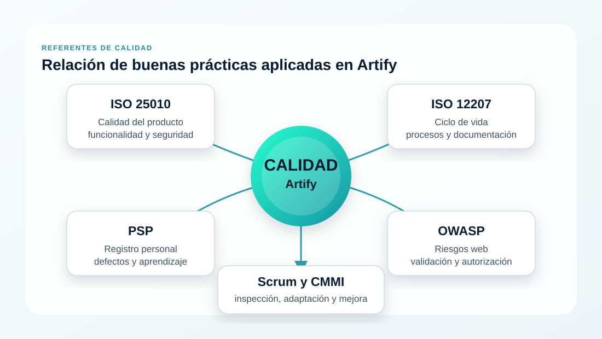
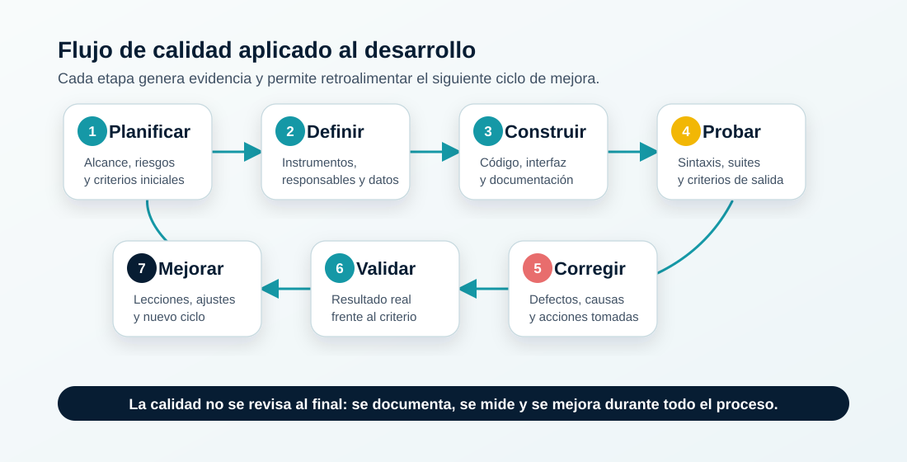
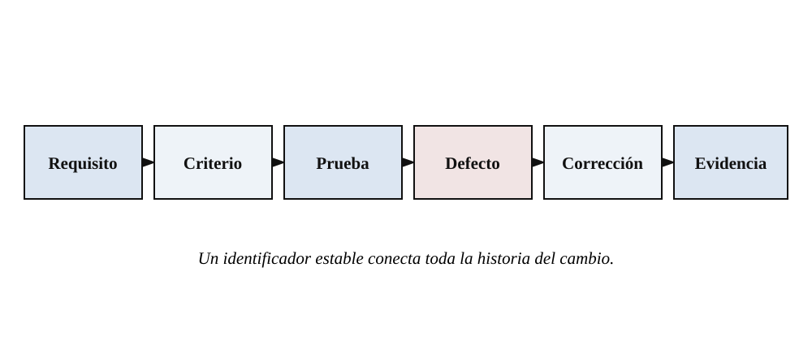
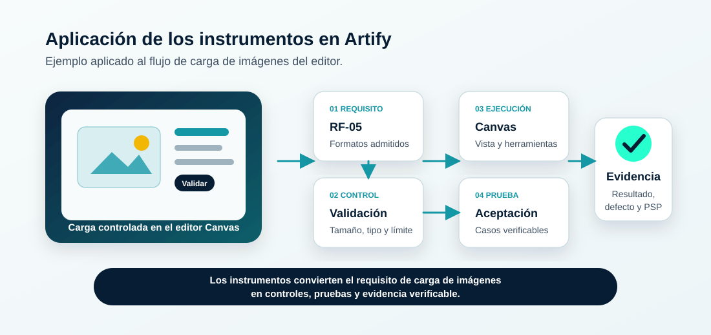

# Diseño de instrumentos de calidad de software

**Aplicación de buenas prácticas de calidad documentadas en las disciplinas de calidad de software**

**Evidencia:** GA11-220501098-AA1-EV02 
**Estudiante:** Iván Darío Madrid Daza 
**Programa:** Análisis y Desarrollo de Software 
**Institución:** Servicio Nacional de Aprendizaje (SENA) 
**Instructor:** José Ignacio Botero Osorio 
**Fecha:** Julio de 2026

---

## Control del documento

| Elemento | Descripción |
| --- | --- |
| Documento | Diseño de instrumentos de calidad de software para Artify |
| Evidencia | GA11-220501098-AA1-EV02 |
| Versión | 1.0 |
| Fecha de elaboración | Julio de 2026 |
| Autor | Iván Darío Madrid Daza |
| Estado | Instrumentos diseñados y listos para diligenciar |

> **Nota de diligenciamiento.** Los formatos se presentan listos para usar. Los campos señalados como ejemplos ilustrativos no representan una ejecución nueva ni sustituyen los resultados técnicos conservados en el repositorio.

## 1. Introducción

En esta evidencia diseño instrumentos para planificar, verificar, registrar y mejorar la calidad de Artify. La calidad del *software* no depende únicamente de encontrar errores al finalizar: también exige requisitos claros, revisiones, pruebas, registro de defectos y aprendizaje continuo. La documentación conserva criterios, responsables y evidencia para que el proceso pueda repetirse y evaluarse.

Artify es una aplicación web de edición de imágenes con frontend HTML, CSS y JavaScript Vanilla, backend Node.js con Express y persistencia PostgreSQL. Los instrumentos se adaptan a su escala académica y no significan que el proyecto posea una certificación ISO o una valoración CMMI.

El diseño cubre requisitos, construcción, revisión técnica, pruebas, seguridad, registro de defectos y mejora personal. Considera el frontend, el backend, PostgreSQL, la documentación y las pruebas existentes de Artify.

## 2. Objetivos

### 2.1 Objetivo general

Diseñar instrumentos documentados que permitan controlar la calidad del desarrollo de Artify mediante buenas prácticas y un proceso personal de trabajo medible.

### 2.2 Objetivos específicos

- Seleccionar prácticas pertinentes de modelos y marcos reconocidos.
- Definir formatos para requisitos, revisiones, pruebas y defectos.
- Aplicar el Proceso Personal de Software (PSP) mediante registros de tiempo, tamaño y defectos.
- Relacionar los instrumentos con una funcionalidad real de Artify sin inventar resultados de ejecución.

## 3. Referentes de calidad seleccionados

Los referentes se utilizan de manera complementaria. ISO/IEC 25010 aporta características de calidad del producto; ISO/IEC/IEEE 12207 organiza procesos del ciclo de vida; MinTIC promueve metodología, trazabilidad y planes de calidad; PSP orienta la medición personal; CMMI y Scrum apoyan la mejora; y OWASP aporta controles iniciales de seguridad web.

> **Figura 1.** Relación de los referentes utilizados en la evidencia. Es un diagrama explicativo y no representa una certificación ni una relación normativa oficial.

| Referente | Aporte principal | Uso en la evidencia |
| --- | --- | --- |
| ISO/IEC 25010:2023 | Características para especificar y evaluar la calidad del producto | Atributos y criterios |
| ISO/IEC/IEEE 12207:2026 | Marco de procesos del ciclo de vida | Flujo y productos |
| MinTIC - MGGTI | Metodología, trazabilidad y plan de calidad | Plan y matriz |
| PSP | Planeación y medición personal | Tiempo y defectos |
| CMMI y Scrum | Inspección, adaptación y mejora | Revisión posterior |
| OWASP Top 10 | Riesgos críticos de aplicaciones web | Lista de seguridad |

Estos referentes no son equivalentes ni deben emplearse como etiquetas de certificación. En Artify se seleccionan únicamente las prácticas proporcionales al alcance, impacto y riesgo del cambio.

## 4. Proceso de calidad propuesto para Artify

El proceso es ligero y repetible. Cada cambio comienza con una necesidad y termina cuando existe evidencia suficiente de su aceptación. Si una revisión o prueba falla, el trabajo regresa a la etapa correspondiente y conserva el registro del hallazgo.

> **Figura 2.** Flujo de planificación, verificación, corrección y mejora.

| Etapa | Actividad | Instrumento | Criterio de salida |
| --- | --- | --- | --- |
| 1. Planificar | Alcance y riesgos | Plan de calidad | Controles definidos |
| 2. Definir | Requisito y aceptación | Trazabilidad | Criterio verificable |
| 3. Construir | Implementar y revisar | Lista técnica | Sin hallazgo crítico |
| 4. Probar | Ejecutar casos | Matriz de pruebas | Resultado registrado |
| 5. Corregir | Resolver defectos | Registro de defectos | Nueva prueba |
| 6. Validar | Comparar con la necesidad | Trazabilidad | Aceptado o pendiente |
| 7. Mejorar | Analizar resultados | PSP y revisión | Acción asignada |

### 4.1 Definición de terminado propuesta

Un cambio se considera terminado cuando sus criterios están identificados, las validaciones aplicables fueron ejecutadas, no quedan defectos críticos abiertos, la documentación está actualizada y la evidencia permite reproducir la comprobación.

## 5. Instrumentos de planificación y trazabilidad

### 5.1 Instrumento 1: plan de calidad

**Objetivo:** acordar cómo se controlará una entrega. 
**Responsable:** desarrollador. 
**Momento:** antes de iniciar y cuando cambie el alcance. 
**Uso:** diligenciar los criterios aplicables y adjuntar enlaces a la evidencia.

| Campo | Contenido propuesto para Artify |
| --- | --- |
| Identificación | Código, versión, fecha y responsable |
| Alcance | Funcionalidad y componentes revisados |
| Atributos | Funcionalidad, seguridad, interacción, fiabilidad y mantenibilidad |
| Controles | Requisitos, código, pruebas, seguridad y documentación |
| Ambientes | Desarrollo; pruebas autorizadas; producción no destructiva |
| Entrada | Requisito, diseño y riesgos comprendidos |
| Salida | Pruebas aprobadas, defectos críticos cerrados y documentación coherente |
| Evidencias | Commits, resultados, registros, capturas sanitizadas y documentos |

**Ejemplo ilustrativo:** para la carga de imágenes, el alcance incluye la validación del formato, peso, megapíxeles y dimensiones antes de asignar el archivo al Canvas. Los criterios se contrastan con RF-05 y con las pruebas existentes del editor.

### 5.2 Instrumento 2: matriz de trazabilidad

**Objetivo:** demostrar la relación entre necesidad, implementación y comprobación. 
**Responsable:** desarrollador. 
**Momento:** desde la definición del requisito hasta su aceptación. 
**Uso:** mantener un identificador estable y actualizar el estado después de cada cambio.

> **Figura 3.** Cadena de trazabilidad de un cambio de *software*.

| ID | Necesidad | Atributo | Criterio | Caso o evidencia | Estado |
| --- | --- | --- | --- | --- | --- |
| RF-05 | Cargar imágenes | Funcional / fiabilidad | Límites y visualización | CP-IMG-01/02 | Por verificar |
| RF-04 | Proteger rutas | Seguridad | Rechazo sin token o rol | Plan backend | Evidencia previa |
| RNF-ACC-01 | Modales con teclado | Interacción | Foco y Escape | E2E y matriz | Evidencia previa |

Los estados permitidos son `propuesto`, `por verificar`, `aprobado`, `rechazado` o `bloqueado`. Una fila no debe marcarse como aprobada sin una referencia a evidencia.

## 6. Listas de verificación

### 6.1 Lista técnica

Marque `Cumple`, `No cumple` o `No aplica` y registre la evidencia o acción correspondiente.

| Categoría | Pregunta de revisión | Resultado o evidencia |
| --- | --- | --- |
| Requisitos | ¿Existe criterio verificable y alcance delimitado? |  |
| Frontend | ¿HTML, foco, mensajes y datos externos se manejan de forma segura? |  |
| Backend | ¿Las entradas se validan y los errores omiten datos sensibles? |  |
| Autorización | ¿Se comprueban identidad, estado y rol actuales? |  |
| PostgreSQL | ¿Las consultas están parametrizadas y conservan integridad? |  |
| Configuración | ¿No existen secretos ni credenciales expuestos? |  |
| Cierre | ¿Se probaron y documentaron los componentes afectados? |  |

### 6.2 Lista de seguridad web

La lista toma OWASP Top 10 como referencia inicial y no sustituye una auditoría profesional.

| Riesgo | Control para Artify | Evidencia |
| --- | --- | --- |
| Acceso | Token, usuario actual y rol en cada ruta privada | Prueba negativa |
| Criptografía | bcrypt y secretos fuera del repositorio | Revisión y prueba |
| Inyección | Parámetros en consultas PostgreSQL | Revisión de consultas |
| Configuración | CORS, cuerpos, caché y cabeceras apropiados | Prueba HTTP |
| Autenticación | Expiración, intentos fallidos y cuentas suspendidas | Casos negativos |
| Integridad | Cambios versionados y validados por CI | Git y resultados |

## 7. Instrumentos de pruebas y defectos

### 7.1 Instrumento 5: matriz de casos de prueba

El resultado esperado se define antes de la ejecución. El resultado obtenido debe conservar evidencia real y un estado controlado.

| ID | Requisito | Datos o pasos | Resultado esperado | Resultado obtenido | Estado |
| --- | --- | --- | --- | --- | --- |
| CP-IMG-01 | RF-05 | Seleccionar un PNG válido | Imagen visible y herramientas activas | Pendiente en esta evidencia | No ejecutado |
| CP-IMG-02 | RF-05 | Seleccionar un archivo mayor a 10 MB | Rechazo y mensaje comprensible | Pendiente en esta evidencia | No ejecutado |
| CP-AUTH-01 | RF-04 | Solicitar una ruta privada sin token | Rechazo sin datos sensibles | Plan existente | Referenciado |

Los estados permitidos son `no ejecutado`, `aprobado`, `fallido` o `bloqueado`. La expresión `referenciado` identifica evidencia previa y no una prueba ejecutada nuevamente para este documento.

### 7.2 Instrumento 6: registro y seguimiento de defectos

El hallazgo se registra al detectarlo, se analiza y se vuelve a probar antes de cambiar su estado a verificado.

| Campo | Contenido requerido |
| --- | --- |
| Identificación | DEF-###, fecha, versión, responsable y origen |
| Fases | Dónde se inyectó y dónde se detectó |
| Impacto | Severidad técnica y prioridad por separado |
| Descripción | Comportamiento observado, esperado y pasos reproducibles |
| Causa | Causa comprobada o análisis; evitar suposiciones |
| Corrección | Cambio realizado y componentes afectados |
| Verificación | Caso repetido, resultado, evidencia y responsable |
| Estado | Abierto, en análisis, corregido, verificado o aplazado |

`Corregido` describe una modificación; `verificado` confirma que el defecto dejó de reproducirse y que el criterio relacionado continúa funcionando.

## 8. Proceso Personal de Software (PSP)

PSP aporta un marco disciplinado para planear, medir y gestionar el trabajo individual. En Artify se adapta mediante registros breves de tiempo, tamaño, defectos y revisión posterior.

### 8.1 Instrumento 7: registro personal

#### Registro de tiempo

| Fecha | Fase | Inicio | Fin | Interrupción | Tiempo neto | Producto |
| --- | --- | --- | --- | --- | --- | --- |
|  | Planificación / diseño / código / revisión / prueba |  |  |  |  |  |

#### Registro personal de defectos

| ID | Tipo | Inyectado en | Detectado en | Tiempo de corrección | Causa | Prevención |
| --- | --- | --- | --- | --- | --- | --- |
|  | Lógica / interfaz / datos / documentación |  |  |  |  |  |

### 8.2 Métricas de interpretación

| Métrica | Cálculo | Uso responsable |
| --- | --- | --- |
| Desviación de tiempo | `(real - estimado) / estimado × 100` | Calibrar estimaciones |
| Aprobación de pruebas | `aprobadas / ejecutadas × 100` | Solo casos ejecutados |
| Remoción previa | `retirados antes de prueba / detectados × 100` | Evaluar revisiones |
| Densidad | `defectos / unidad de tamaño` | Solo con tamaño comparable |
| Corrección verificada | `verificados / registrados × 100` | Diferenciar cambio y comprobación |

### 8.3 Instrumento 8: revisión posterior

- Comparar lo planeado con lo entregado y registrar las validaciones.
- Identificar la fase con más defectos y la estimación que más se desvió.
- Elegir una mejora con responsable, fecha y criterio de verificación.

## 9. Aplicación integrada en Artify

La aplicación se realiza sobre RF-05, requisito real documentado en el proyecto. Los resultados identificados como evidencia previa proceden del repositorio; los campos no ejecutados conservan ese estado para evitar presentar una simulación como resultado real.

> **Figura 4.** Aplicación de los instrumentos en la carga de imágenes de Artify.

| Elemento | Aplicación |
| --- | --- |
| Requisito | RF-05: cargar JPG, PNG o WebP desde el navegador |
| Criterios | Máximo 10 MB, 16 MP y 8192 px por lado; imagen visible y herramientas activas |
| Riesgo | Consumo excesivo de memoria o archivo incompatible antes del Canvas |
| Atributos | Adecuación funcional, fiabilidad, interacción y seguridad |
| Componentes | Editor HTML y módulos JavaScript de imagen, sesión y almacenamiento |
| Casos | Archivo válido; formato, peso, megapíxeles o lado excedido |
| Evidencia | Requisito, pruebas frontend y flujo E2E documentados |
| Cierre | Casos aprobados, defecto crítico cerrado y documentación coherente |

### 9.1 Ejemplo ilustrativo del uso de PSP

Antes de modificar la carga se estima el tiempo de revisión, construcción y prueba. Durante el trabajo se registra el tiempo neto y cada defecto. Si se repite el olvido de un límite de archivo, la acción preventiva consiste en incorporarlo a la lista técnica y conservar una prueba negativa específica. Este ejemplo explica el método y no afirma que se haya realizado una modificación nueva para esta evidencia.

## 10. Buenas prácticas seleccionadas

| Buena práctica | Referente | Aplicación en Artify | Evidencia |
| --- | --- | --- | --- |
| Definir atributos medibles | ISO 25010 | Criterios verificables | Plan de calidad |
| Conservar trazabilidad | ISO 12207 / MinTIC | Relacionar requisito, prueba y cierre | Matriz |
| Inspeccionar y adaptar | Scrum | Revisar resultados y ajustar | Revisión posterior |
| Medir el trabajo personal | PSP | Tiempo, tamaño y defectos | Registro PSP |
| Prevenir defectos | PSP / CMMI | Revisar antes de probar | Listas |
| Probar riesgos web | OWASP | Acceso, entradas y configuración | Lista de seguridad |
| Definir terminado | Scrum | Código, prueba y documentación | Criterio de salida |

### 10.1 Recomendaciones

#### Acciones inmediatas

- Adoptar la matriz de trazabilidad en cambios funcionales o de seguridad.
- Aplicar las listas técnica y OWASP antes de integrar cambios sensibles.
- Registrar una tarea pequeña con PSP para obtener una línea base real.

#### Acciones de mediano plazo

- Unificar la cifra vigente de pruebas después de ejecutar las suites correspondientes.
- Convertir criterios críticos en pruebas automatizadas reproducibles.
- Actualizar las listas cuando aparezcan defectos repetidos.

#### Acciones futuras

- Definir umbrales con datos históricos propios.
- Ampliar accesibilidad y seguridad antes de declarar conformidad formal.
- Retirar controles que no aporten evidencia ni reduzcan riesgo.

## 11. Orientaciones para usar los instrumentos

Los formatos se aplican según el riesgo y no como una lista mecánica. Una tarea pequeña puede necesitar únicamente trazabilidad, una lista técnica y una prueba; un cambio de autenticación requiere además controles de seguridad y mayor evidencia.

| Instrumento | Cuándo se aplica | Producto esperado |
| --- | --- | --- |
| Plan de calidad | Antes de iniciar o cambiar el alcance | Controles y criterios acordados |
| Trazabilidad | Desde el requisito hasta la aceptación | Relaciones y estado |
| Lista técnica | Antes de integrar | Revisión registrada |
| Lista OWASP | En cambios web sensibles | Controles y evidencia |
| Casos de prueba | Antes y después de construir | Resultado reproducible |
| Defectos | Al detectar una desviación | Ciclo completo del hallazgo |
| Registro PSP | Durante la tarea | Tiempo y defectos personales |
| Revisión posterior | Al finalizar | Acción de mejora asignada |

## 12. Conclusiones

- Los instrumentos convierten las buenas prácticas en acciones observables con responsable, momento, resultado y evidencia.
- La trazabilidad permite comprender por qué se realizó un cambio, cómo se verificó y qué falta por resolver.
- PSP ayuda a mejorar estimaciones y revisiones cuando el tiempo y los defectos se interpretan en contexto.
- Artify puede aplicar un proceso proporcional que aprovecha su documentación y pruebas existentes sin imponer una estructura excesiva.

Como resultado quedan ocho instrumentos listos para diligenciar: plan de calidad, trazabilidad, dos listas de verificación, matriz de pruebas, registro de defectos, registro PSP y revisión posterior.

---

## Referencias

CMMI Institute. (s. f.). *CMMI Development*. Consultado el 30 de julio de 2026. https://cmmiinstitute.com/products/cmmi/cmmi-dev

Humphrey, W. S. (2000). *The Personal Software Process (PSP)* (CMU/SEI-2000-TR-022). Software Engineering Institute, Carnegie Mellon University. https://doi.org/10.1184/R1/6585197.v1

International Organization for Standardization. (2023). *ISO/IEC 25010:2023: Systems and software engineering - Systems and software Quality Requirements and Evaluation (SQuaRE) - Product quality model*. https://www.iso.org/standard/78176.html

International Organization for Standardization. (2026). *ISO/IEC/IEEE 12207:2026: Systems and software engineering - Software life cycle processes*. https://www.iso.org/standard/90219.html

ISO 25000. (s. f.). *ISO/IEC 25010*. Consultado el 30 de julio de 2026. https://iso25000.com/index.php/11-espanol/iso-iec-25010

Ministerio de Tecnologías de la Información y las Comunicaciones. (s. f.). *Modelo de Gestión y Gobierno TI (MGGTI)*. Consultado el 30 de julio de 2026. https://mintic.gov.co/arquitecturaempresarial/portal/modelomrae/Modelo-de-Gestion-y-Gobierno-TI-MGGTI/

OWASP Foundation. (2021). *OWASP Top 10:2021*. https://owasp.org/Top10/2021/es/

Schwaber, K., & Sutherland, J. (2020). *La Guía de Scrum: la guía definitiva de Scrum, las reglas del juego*. https://scrumguides.org/download.html

> **Nota.** Las normas ISO se consultaron mediante sus fichas oficiales y recursos públicos. Este documento no reproduce su contenido protegido ni declara conformidad o certificación.

---

*Proyecto Artify - Análisis y Desarrollo de Software - SENA 2026*
